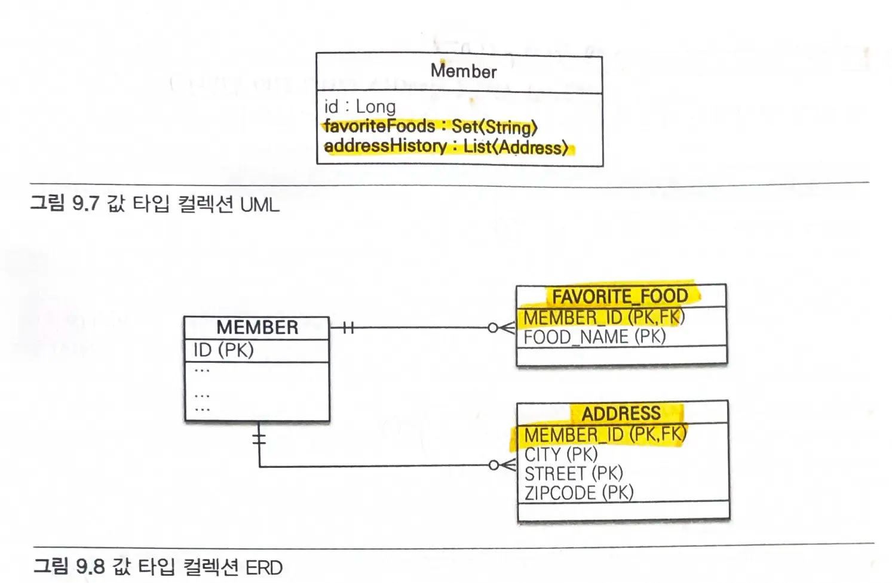

# 9장. 값 타입

### **JPA 데이터 타입**
* `엔티티 타입` (`@Entity`)
    * `식별자`를 통해 추적 가능
* `값 타입` (java 기본 타입이나 객체)
    * 식별자가 없고 속성만 있으므로 추적 불가
    * 단순한 수치 정보
> `엔티티`는 공유될 수 있으므로 `참조한다`고 표현한다.
> `값 타입`은 특정 주인에 소속되고, 논리적인 개념상 공유하지 않으므로 `포함한다`고 표현한다.

**값 타입**
* `기본값 타입`
    * 자바 기본 타입 (`int`, `double`)
    * 래퍼 클래스 (`Integer`)
    * `String`
* `임베디드 타입` (사용자 정의 값 타입)
* `컬렉션 값 타입` (하나 이상 값 타입)

# 9.1 기본값 타입
```java
@Entity
public class Member {

    @Id @GeneratedValue
    @Column(name = "MEMBER_ID")
    private Long id;

    private String name;

    @Embedded
    private Address address;

	// Getter, Setter

    @Override
    public String toString() {
        return "Member{" +
                "id=" + id +
                ", name='" + name + '\'' +
                ", address=" + address +
                '}';
    }
}
```
- 값 타입 : `id`, `name`
    - 식별자가 없고 생명주기도 회원 엔티티에 의존한다.
    - 공유해서는 안된다.
> 기본 타입(primitive type)은 절대 공유하지 않는다.

- 엔티티 타입 : `Member`
    - 식별자가 있다.

## 9.2 임베디드 타입 (복합 값 타입): `@Embeddable`, `@Embedded`
### 임베디드 타입이란?
* **새로운 `값 타입`을 직접 지정**한 것
    * 직접 정의한 임베디드 타입도 `값 타입`으로 이루어져 있다.
- `기본 생성자`가 필수이다.
- 모든 `값 타입`은 `엔티티`의 생명주기에 의존하므로, `엔티티`와 `임베디드 타입`의 관계를 UML로 표현하면 `컴포지션` 관계가 된다.

### 임베디드 타입 만들기
#### 기존 코드
```java
@Entity
public class Member {

    @Id @GeneratedValue
    @Column(name = "MEMBER_ID")
    private Long id;

    private String name;

    // 근무 기간
    @Temporal(TemporalType.DATE) Date startDate;
	@Temporal(TemporalType.DATE) Date endDate;

	// 집 주소 표현
	private String city;
	private String street;
	private String zipcode;
}
```
- 단순히 정보를 풀어둔 것 말고, 응집력 있게 묶자.
    -  `임베디드 타입`을 사용해서  근무 기간과 집 주소로 묶자.

#### 결과 코드
```java
@Entity
public class Member {

    @Id @GeneratedValue
    @Column(name = "MEMBER_ID")
    private Long id;

    private String name;

    // 근무 기간
    @Embedded Period workPeriod;

	// 집 주소 표현
	@Embedded Address homeAddress;
}
```

```java
@Embeddable
public class Address {

    private String city;
    private String street;
    private String zipcode;

    public Address() {
    }

    public Address(String city, String street, String zipcode) {
        this.city = city;
        this.street = street;
        this.zipcode = zipcode;
    }
}
```

```java
@Embeddable
public class Period {

    @Temporal(TemporalType.DATE) Date startDate;
	@Temporal(TemporalType.DATE) Date endDate;

    public Period() {
    }

    public Period(Date startDate, Date endDate) {
        this.startDate = startDate;
        this.endDate = endDate;
    }
}
```
> 임베디드 타입을 사용해서 더욱 의미있고 재사용가능하며 응집력 있게 변했다.

#### @Embeddable
- 값 타입을 정의하는 곳에 표시

#### @Embedded
- 값 타입을 사용하는 곳에 표시

### 임베디드 타입과 테이블 매핑
- `임베디드 타입`은 엔티티의 값일 뿐이다.
    - 엔티티 테이블에 값을 매핑한다.
    - **임베디드 타입을 사용해도 여전히 매핑되는 테이블은 같다.**
> 잘 설계한 ORM 애플리케이션은 매핑한 테이블의 수보다 클래스의 수가 더 많다.

* 속성 재정의 : `@AttributeOverride`
    * 임베디드 타입에 정의한 매핑정보를 재정의한다.
```java
@Entity
public class Member {

    @Id @GeneratedValue
    @Column(name = "MEMBER_ID")
    private Long id;

    private String name;

	@Embedded Address homeAddress;
	@Embedded
	@AttributeOverrides({
	    @AttributeOverride(name = "city", column = @Column(name="COMPANY_CITY")),
		@AttributeOverride(name = "street", column = @Column(name="COMPANY_STREET")),
		@AttributeOverride(name = "zipcode", column = @Column(name="COMPANY_ZIPCODE"))
	})
	Address companyAddress;
}
```
> @AttributeOverrides 는 엔티티에 설정해야 한다.

### 임베디드 타입과 null
-  임베디드 타입이 `null`이면 매핑한 컬럼 값은 모두 `null`이 된다.

## 9.3 값 타입과 불변 객체
### 값 타입 공유 참조
* 값 타입을 여러 엔티티에서 공유하면 위험하다.
    * 같은 참조를 가지고 있기 때문에 부작용이 일어난다.
- 값 타입은 값을 복사해서 사용해야한다.
> 부작용: 전혀 예상치 못한 곳에서 문제가 발생하는 것

### 값 타입 복사
- 기본 타입에 값을 대입하면 값을 복사해서 전달한다.
    - `a=b`
- 객체에 값을 대입하면 참조값을 전달한다.
    - 공유 참조로 인한 부작용이 발생한다.
    - **임베디드 타입과 같은 객체 타입은 값을 복사(`clone`)해서 사용해야한다.**
- 객체의 공유 참조는 피할 수 없다.
    - 객체의 값을 수정하지 못하게 막으면 된다.

### 불변 객체
- **값 타입은 될 수 있으면 `불변 객체`로 설계해야한다.**
    - 객체를 불변하게 만들면 값을 수정할 수 없으므로 부작용을 차단할 수 있다.
    - 참조값을 공유해도 인스턴스의 값을 수정할 수 없으므로 부작용이 발생하지 않는다.
- `생성자`로만 값을 설정하고 `수정자`를 만들지 않으면 된다.
> 불변이라는 작은 제약으로 부작용이라는 큰 재앙을 막을 수 있다.


## 9.4 값 타입의 비교
### **동일성 vs 동등성 비교**
* 동일성 비교(`\==`), 참조값 비교
* 동등성 비교(`equals()`), 값 비교
> 값 타입은 인스턴스가 달라도 그 안에 값이 같으면 같은 것으로 봐야한다.

#### `equals()`
- 값 타입은 `equals()`, `hashcode()` 메서드를 재정의해야한다.
> 보통 모든 필드의 값을 비교하도록 구현한다.

### 값 타입 컬렉션
- 값 타입을 하나 이상 저장하려면 컬렉션에 보관하고 `@ElementCollection`, `@CollectionTable` 을 사용하면 된다.
```java
@Entity
public class Member {

    @Id @GeneratedValue
    @Column(name = "MEMBER_ID")
    private Long id;

    private String name;

	@Embedded Address homeAddress;

	@ElementCollection
	@CollectionTable(name="FAVORITE_FOODS",
		joinColumns = @JoinColumn(name="MEMBER_ID"))
	@Column(name="FOOD_NAME")
	private Set<String> favoriteFoods = new HashSet<String>();

	@ElementCollection
	@CollectionTable(name="ADDRESS",
		joinColumns = @JoinColumn(name="MEMBER_ID"))
	@Column(name="MEMBER_ID")
	private List<Address> addressHisotry = new ArrayList<Address>();
}
```
- 그림



- `관계형 데이터베이스`의 테이블은 컬럼 안에 컬렉션을 포함할 수 없다.
    * 별도의 테이블을 추가하고 `@CollectionTable` 을 사용해서 추가한 테이블을 매핑한다.
> 따로 이름을 지정하지 않으면 엔티티이름_컬렉션속성이름으로 매핑한다.
* 테이블 매핑 정보는 `@AttributeOverride` 를 사용해서 재정의한다.
- 값 타입 컬렉션은 영속성 전이 + 고아 객체 기능을 필수로 가진다고 볼 수 있다.
* 값 타입 컬렉션의 `기본 FetchType`은 `LAZY`이다.

#### 값 타입 컬렉션의 제약사항
- 값 타입 컬렉션이 매핑된 테이블은 **모든 컬럼을 묶어서 기본 키를 구성**해야한다.
    - 기본 키 제약조건으로 인해 컬럼에 `null`을 입력할 수 없고, 같은 값을 중복해서 저장할 수 없다.
- 값 타입은 `식별자`가 없고 단순한 값들의 모음이므로 값을 변경하면 db에 저장한 원본 데이터를 찾기 어렵다.
    - 값 타입 컬렉션에 변경 사항이 발생하면, **값 타입 컬렉션이 매핑된 테이블의 연관된 모든 데이터를 삭제**하고, **현재 값 타입 컬렉션 객체에 있는 모든 값을 db에 다시 저장한다.**
    - 실무에서 값 타입 컬렉션이 매핑된 테이블에 데이터가 많다면 값 타입 컬렉션 대신 `일대다 관계`를 고려해야한다.
> 일대다 관계에 영속성 전이(Cascade) + 고아 객체 제거 기능을 적용하면 값 타입 컬렉션처럼 사용할 수 있다.

***=> 추천 방법: 값 타입 컬렉션을 사용하지말고 일대다 + 영속성 전이(cascade) + 고아객체제거(orphanRemoval)를 수행하자.***
```java
@OneToMany(cascade = CascadeType.ALL, orphanRemoval = true)
@JoinColllumn(name="MEMBER_ID")
private List<AddressEntity> addressHisotry = new ArrayList<AddressEntity>();
```
> 값 타입 컬렉션을 변경했을때 테이블의 기본키를 식별해서 변경된 내용만 반영하려고 노력한다.
> 하지만 사용하는 컬렉션이나 여러조건에 따라 기본키를 식별하지 못할 수도 있다.
> 따라서 값 타입 컬렉션을 사용할 때는 모두 삭제하고 다시 저장하는 최악의 시나리오를 고려해야한다.

# 9.6 정리
## 엔티티 타입의 특징
- 식별자(@Id)가 있다.
- 생명 주기가 있다.
    - 생성하고, 영속화하고,, 소멸하는 생명 주기가 있다.
- 공유할 수 있다.
    - 참조값을 공유할 수 있다.

## 값 타입의 특징
- 식별자가 없다.
- 생명주기를 엔티티에 의존한다.
    - 의존하는 엔티티를 제거하면 같이 제거된다.
- 공유하지 않는 것이 안전하다.
    - 값을 복사해서 사용해야한다.
    - 불변 객체로 만드는 것이 안전하다.

> 식별자가 필요하고 지속해서 값을 추적하고 구분하고 변경해야 한다면 값 타입이 아니라 엔티티다.

