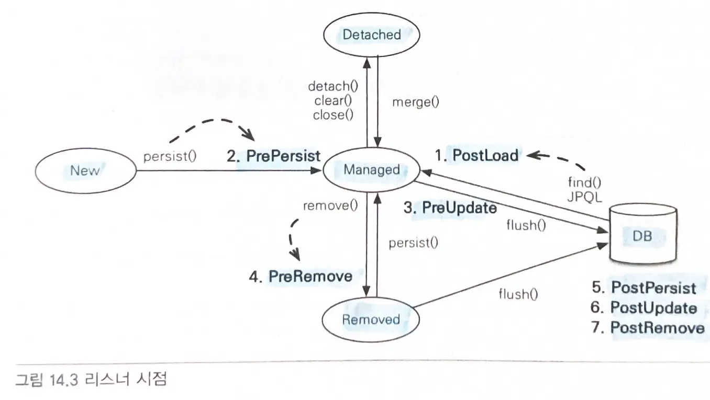

# 14장. 컬렉션과 부가 기능

# 14.1 컬렉션
- `@OneToMany`, `@ManyToMany`를 이용해서 일대다나 다대다 관계를 매핑할 때
- `@ElementCollection`을 사용해서 값 타입을 하나 이상 보관할 때

## JPA와 컬렉션
- hibernate는 엔티티를 영속 상태로 만들 때 컬렉션 필드를 하이버네이트에서 준비한 컬렉션으로 감싸서 사용한다.
- **Collection, List -> PersistentBag**
    - 중복된 엔티티가 있는지 비교하지 않으므로 엔티티를 추가해도 지연 로딩된 컬렉션을 초기화하지 않는다.
- **Set -> PersistentSet**
    - 중복된 엔티티가 있는지 비교하므로 엔티티 추가시 지연 로딩된 컬렉션을 초기화한다.
- **List + @OrderColumn -> PersistentList**
    - `@OrderColumn `: `순서값`을 저장해서 조회할 때 사용한다.
        - `@OneToMany`에서 다 테이블에서 매핑하므로 순서값을 알 수 없어 추가 sql문이 발생한다.
        - List 변경시 순서값도 변경해야하고, 중간에 값이 없으면 `null`이 저장되어 값 순회시 `NPE`가 발생할 수 있다.
> @OrderColumn을 사용하지 말고, 개발자가 직접 순서값을 관리하거나 @OrderBy를 사용하자.
- `@OrderBy` : 컬렉션을 정렬할 때 사용한다. 엔티티의 필드를 대상으로 한다.
    - 모든 컬렉션에 사용할 수 있다.

# 14.2 컨버터(@Converter)
- 엔티티의 데이터를 변환해서 데이터베이스에 저장할 수 있다.

## 컨버터
- `@Converter` 어노테이션 사용하고 `AttributeConverter` 인터페이스를 구현한다.
    - 현재 타입과 변환할 타입을 지정한다.
    - 클래스 레벨에도 적용 가능하다.
- `convertToDatabaseColumn()` : 엔티티의 데이터를 데이터베이스 컬럼에 저장할 데이터로 변환한다.
- `convertToEntityAttribute()` : 조회한 컬럼 데이터를 엔티티의 데이터로 변환한다.


### 클래스 레벨 설정
- `@Convert(converter=BooleanToYNConverter.class, attributeName="vip")`

### 글로벌 설정
- 모든 `Boolean` 타입에 컨버터를 적용하려면 `@Converter(autoApply=true)` 옵션 적용하기

# 14.3 리스너
- JPA의 리스너 기능을 사용하면 `엔티티의 생명주기에 따른 이벤트`를 처리할 수 있다.

## 이벤트 종류



-  `PostLoad` : 엔티티가 영속성 컨텍스트에 조회된 직후 또는 refresh 호출 후
    - 2차 캐시에 저장되어있어도 호출된다.
- `PrePersist` : persist() 메서드 호출해서 엔티티를 영속성 컨텍스트에 관리하기 직전
    - 새로운 인스턴스를 merge할때도 수행된다.
- `PreUpdate` : flush나 commit 호출해서 엔티티를 데이터베이스에 수정하기 직전
- `PreRemove` : remove() 메서드 호출해서 엔티티를 영속성 컨텍스트에서 삭제하기 직전
- `PostPersist` : flush나 commit 호출해서 엔티티를 데이터베이스에 저장한 직후
- `PostUpdate`: flush나 commit 호출해서 엔티티를 데이터베이스에 수정한 직후
- `PostRemove` : flush나 commit 호출해서 엔티티를 데이터베이스에 삭제한 직후

## 이벤트 적용 위치
### 1. 엔티티에 직접 적용
`@PrePersist`, `@PostLoad` ...
엔티티에 이벤트가 발생할 때마다 어노테이션으로 지정한 메서드가 실행된다.

### 2. 별도의 리스너 등록
- `@EntityListeners(DuckListener.class)`
- 리스너 클래스 메서드의 반환 타입은 `void`이다.

### 3. 기본 리스너 사용
- `META-INF/orm.xml`에 기본 리스너로 등록

### 이벤트 호출 순서
1. 기본 리스너
2. 부모 클래스 리스너
3. 리스너
4. 엔티티
- `ExcludeDefaultListeners`: 기본 리스너 무시
- `ExcludeSuperclassListeners` : 상위 클래스 이벤트 리스너 무시

# 14.4 엔티티 그래프 (@EntityGraph)
- 엔티티를 조회할 때 연관된 엔티티들을 함께 조회하려면 `FetchType.EAGER`로 선택하거나 JPQL에서 `fetch join`을 사용한다.
    - 글로벌 fetch 옵션은 애플리케이션 전체에 영향을 주고 변경할 수 없다.
    - 따라서 `LAZY`로 사용하고 연관된 엔티티를 함께 조회하려면 JPQL의 `fetch join`을 사용하자.
- 함께 조회할 엔티티에 따라 JPQL을 달리 써야하는 문제가 있다.
    - => 엔티티 그래프 기능을 이용하자.

## 엔티티 그래프
- 엔티티 조회시점에 연관된 엔티티들을 함께 조회하는 기능
- 정적으로 정의하는 `Named 엔티티 그래프`와 동적으로 정의하는 `엔티티 그래프`가 있다.

### Named 엔티티 그래프
```java
@NamedEntityGraph(name = "Order.withMember", attributeNodes = {
    @NamedAttributeNode("member")
})
@Entity
@Table(name = "ORDERS")
public class Order {

    @Id @GeneratedValue
    @Column(name = "ORDER_ID")
    private Long id;

    @ManyToOne(fetch = FetchType.LAZY, optional = false)
    @JoinColumn(name = "MEMBER_ID")
    private Member member;    // 주문 회원 
}
```
- `@NamedEntityGraph`로 정의한다.
    - `name`: 엔티티 그래프 이름
    - `attributeNodes`: 함께 조회할 속성 선택
- 둘 이상이면 `@NameEntityGraphs`를 사용하면 된다.

### em.find()에서 엔티티 그래프 사용
```java
EntityGraph graph = em.getEntityGraph("Order.withMember");

Map<String, Object> hints = new HashMap<>();
hints.put("javax.persistence.fetchgraph", graph);

Order order = em.find(Order.class, orderId, hints);
```
- 엔티티 그래프를 찾아 힌트의 값으로 사용하고 key는 `javax.persistence.fetchgraph`를 사용한다.

### subgraph
```java
@NamedEntityGraph(name = "Order.withAll", 
    attributeNodes = {
        @NamedAttributeNode("member"),
        @NamedAttributeNode(value = "orderItems", subgraph = "orderItems")
    },
    subgraphs = @NamedSubgraph(name = "orderItems", attributeNodes = {
        @NamedAttributeNode("item")
    })
)
@Entity
@Table(name = "ORDERS")
public class Order {

    @Id @GeneratedValue
    @Column(name = "ORDER_ID")
    private Long id;

    @ManyToOne(fetch = FetchType.LAZY, optional = false)
    @JoinColumn(name = "MEMBER_ID")
    private Member member;    // 주문 회원

    @OneToMany(mappedBy = "order", cascade = CascadeType.ALL)
    private List<OrderItem> orderItems = new ArrayList<>();
}

@Entity
@Table(name = "ORDER_ITEM")
public class OrderItem {

    @Id @GeneratedValue
    @Column(name = "ORDER_ITEM_ID")
    private Long id;

    @ManyToOne(fetch = FetchType.LAZY)
    @JoinColumn(name = "ITEM_ID")
    private Item item;    
}
```
- Order -> OrderItem -> Item까지 함께 조회하려면 `subgraph`를 사용한다.
- `@NamedSubGraph`를 사용해서 서브 그래프를 정의한다.

### JPQL에서 엔티티 그래프 사용
```java
List<Order> resultList = 
    em.createQuery("select o from Order o where o.id = :orderId", 
                   Order.class)
      .setParameter("orderId", orderId)
      .setHint("javax.persistence.fetchgraph", em.getEntityGraph("Order.withAll"))
      .getResultList();
```
- `setHint`로 지정하여 엔티티 그래프를 가져와 key를 `javax.persistence.fetchgraph`로 사용한다.
> `em.find()`에서 엔티티 그래프를 사용하면 hibernate는 필수 관계일때 내부 조인을 사용하지만, jpql에서는 항상 외부 조인을 사용한다.
내부 조인을 사용하려면 명시해주어야 한다.

### 동적 엔티티 그래프
```java
EntityGraph<Order> graph = em.createEntityGraph(Order.class);
graph.addAttributeNodes("member");
Subgraph<OrderItem> orderItems = graph.addSubgraph("orderItems");
orderItems.addAttributeNodes("item");

Map<String, Object> hints = new HashMap<>();
hints.put("javax.persistence.fetchgraph", graph);

Order order = em.find(Order.class, orderId, hints);
```
- `createEntityGraph()`메서드를 사용하면 된다.

### 엔티티 그래프 정리
- `ROOT`에서 시작
- 영속성 컨텍스트에 이미 로딩된 엔티티는 엔티티 그래프가 적용되지 않는다.
    - 연관된 엔티티를 함께 조회하지 않는다.
- `fetchgraph`: 엔티티 그래프에 선택한 속성만 함께 조회
- `loadgraph`: FetchType.EAGER로 설정된 연관관계도 함께 조회

# 14.5 정리
- `JPA가 지원하는 컬렉션`의 종류와 특징을 알아보았다.
- `컨버터`: 엔티티의 데이터를 변환해서 데이터베이스에 저장
- `리스너`: 엔티티에서 발생한 이벤트를 받아서 처리
- `fetch join`: 객체지향 쿼리를 사용하지만, 엔티티 그래프를 사용하면 원하는 객체 그래프 한번에 조회할 수 있다.
