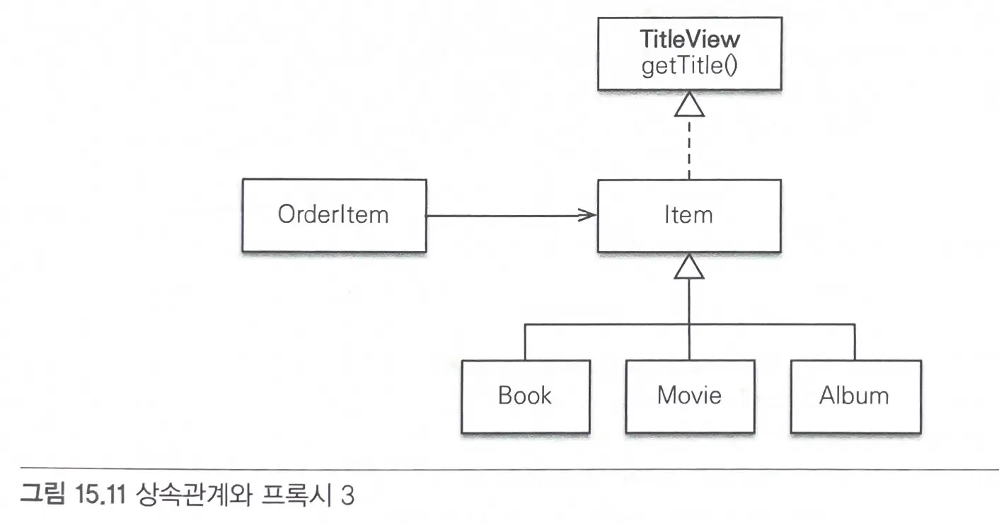
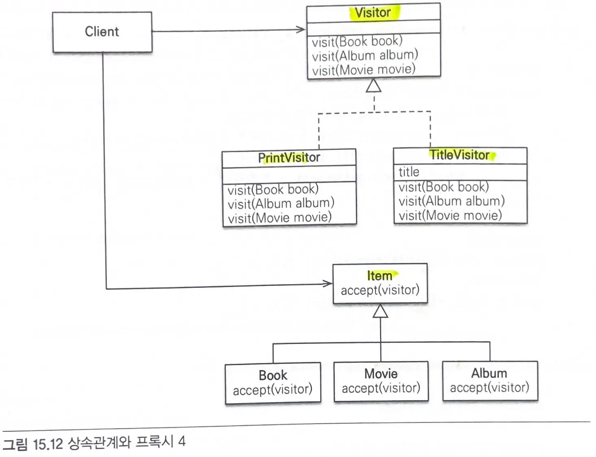

# 15장. 고급 주제와 성능 최적화

# 15.1 예외 처리
### JPA 표준 예외 정리
- JPA 예외는 모두 언체크 예외이다.
- **트랜잭션 롤백을 표시하는 예외**
  - 심각한 예외이므로 복구해서는 안된다.
  - 강제로 커밋해도 트랜잭션이 커밋되지 않고 `RollbackException` 예외가 발생한다.
- **트랜잭션 롤백을 표시하지 않는 예외**
  - 심각한 예외가 아니다.
  - 개발자가 커밋할지 롤백할지 선택하면 된다.

### 스프링 프레임워크의 JPA 예외 변환
- 서비스 계층에서 `JPA 예외`를 직접 사용하면 `JPA`에 의존하게 된다.
- 스프링 프레임워크는 데이터 접근 계층에 대한 예외를 추상화해서 개발자에게 제공한다.
  - `JPA 예외` -> `스프링 예외`

### 스프링 프레임워크에 JPA 예외 변환기 사용
- JPA 예외를 스프링 프레임워크가 제공하는 추상화된 예외로 변경하려면 `PersistenceExceptionTranslationPostProcessor`를 스프링 빈으로 등록하면 된다.
- `@Repository`를 사용한 곳에 `예외 변환 AOP`를 적용해서 `JPA 예외`를 `스프링 프레임워크가 추상화한 예외`로 변환해준다.
- 예외를 변환하고 싶지 않다면 `throws` 절에 그대로 반환할 JPA 예외나 JPA 예외의 부모 클래스를 직접 명시하면 된다.

### 트랜잭션 롤백시 주의사항
- 트랜잭션을 롤백하는 것은 데이터베이스의 반영 사항만 롤백하는 것이지 수정한 자바 객체까지 원상태로 복구해주지는 않는다.
  - **객체는 수정된 상태로 영속성 컨텍스트에 남아있다.**
- 따라서 롤백된 영속성 컨텍스트를 그대로 사용하는 것보다 새로운 영속성 컨텍스트를 생성해서 사용하거나,  `EntityManager.clear()`를 호출해서 영속성 컨텍스트를 초기화한 다음에 사용해야한다.

- **트랜잭션당 영속성 컨텍스트 전략** : 문제가 발생하면 트랜잭션을 롤백하면서 영속성 컨텍스트도 함께 종료하므로 문제가 발생하지 않는다.
- **OSIV**: 여러 트랜잭션이 하나의 영속성 컨텍스트를 사용하므로 롤백 후 다른 트랜잭션이 영속성 컨텍스트를 사용할 수 있는 문제가 있다.
  - **스프링 OSIV**는 `트랜잭션 롤백시 영속성 컨텍스트를 초기화`해서 잘못된 영속성 컨텍스트를 사용하는 문제를 예방한다.

# 15.2 엔티티 비교
- **1차 캐시**: 영속성 컨텍스트 내부에는 엔티티 인스턴스를 보관하기 위한 1차 캐시가 있다.
  - 1차 캐시는 영속성 컨텍스트와 생명주기가 같다.
  - 영속성 컨텍스트를 통해 데이터를 저장하거나 조회하면 1차 캐시에 엔티티가 저장된다.
  - `변경 감지`도 동작하고, 데이터베이스를 통하지 않고 데이터를 바로 조회할 수 있다.
  - **애플리케이션 수준의 반복 가능한 읽기**(항상 같은 엔티티 인스턴스 반환)을 제공한다.
    - 주소값이 같은 인스턴스를 반환한다.

### 영속성 컨텍스트가 같을 때 엔티티 비교
- 테스트 클래스에 `@Transactional`이 있으면 트랜잭션을 먼저 시작하고 테스트 메서드를 수행한다.
- 같은 트랜잭션 범위에 있으면 같은 영속성 컨텍스트를 사용하므로 동일성(`\==`), 동등성(`equals()`), 데이터베이스 동등성(`@Id`)을 모두 만족한다.

### 영속성 컨텍스트가 다를때 엔티티 비교
- 테스트에 `@Transactional`이 없고 서비스에 `@Transactional`이 있을 때
  - 서비스에서 조회한 엔티티 레포지토리에서 조회한 엔티티는 다른 영속성 컨텍스트(트랜잭션)에서 각각 조회한 엔티티이므로 서로 다른 인스턴스를 반환한다.
  - 동일성(`\==`) 비교에 실패한다.
- 다른 영속성 컨텍스트에서 조회하더라도 같은 엔티티이므로 동등성 비교에 성공해야한다.
  - `데이터베이스 동등성 비교(db 식별자)` 나 `동등성 비교(비즈니스 키)`를 통해 같게 판단하도록 하자.
    - 비즈니스 키는 보통 중복되지 않고 거의 변하지 않는 데이터베이스 기본키 후보들이 좋다.
    - db 기본키처럼 딱딱하게 정하지 않아도 되고, 가끔 변해도 괜찮다.
> 동일성 비교는 같은 영속성 컨텍스트의 관리를 받는 영속 상태의 엔티티에만 적용할 수 있다.
> 그렇지 않을 때는 `비즈니스 키`를 사용한 동등성 비교를 해야 한다.

# 15.3 프록시 심화 주제
- `프록시`는 `원본 엔티티`를 상속받아 만들어진다.
  - 이를 통해 클라이언트는 엔티티가 프록시인지 원본 엔티티인지 구분하지 않고 사용할 수 있다.

## 영속성 컨텍스트와 프록시
- 영속성 컨텍스트는 자신이 관리하는 영속 엔티티의 동일성을 보장한다.
- **프록시로 조회한 엔티티의 동일성도 보장한다.**
  - 프록시로 먼저 조회한 후 엔티티를 조회하면 `처음 조회된 프록시`를 반환한다.
  - 엔티티를 조회한 후 프록시를 조회하면 `엔티티`를 반환한다.

### 프록시 타입 비교
- 프록시와 원본 엔티티를 비교할 때는 `\==`이 아니라 `instanceof`를 사용해야 한다.
  - 프록시는 원본 엔티티를 상속받는 자식이기 때문이다.

### 프록시 동등성 비교
- 프록시 타입 비교는 `\==` 비교 대신에 `instanceof`를 사용해야 한다.
- 프록시의 멤버변수에 직접 접근하면 안되고, 대신에 접근자 메서드(`getter`)를 사용해야한다.
  - 프록시의 필드에 직접 접근할 경우 아무 값도 조회할 수 없다.

## 상속관계와 프록시
프록시를 부모 타입으로 조회하면 부모의 타입을 기반으로 프록시가 생성된다.
- `instanceof` 연산을 사용할 수 없다.
- 하위타입으로 다운캐스팅을 할 수 없다.
> 지연로딩시에 부모의 타입으로 조회할 경우 부모의 타입을 기반으로 프록시가 생성된다.

### 해결방법1. `JPQL`로 대상 직접 조회
- 처음부터 자식 타입으로 직접 조회한다.
```java
Book jpqlBook = em.createQuery(
    "select b from Book b where b.id = :bookId", Book.class)
    .setParameter("bookId", item.getId())
    .getSingleResult();
```

### 해결방법2. 프록시 벗기기
```java
// 프록시 객체 처리
Item item = orderItem.getItem();
Item unProxyItem = unProxy(item);

if (unProxyItem instanceof Book) {
    System.out.println("proxyItem instanceof Book");
    Book book = (Book) unProxyItem;
    System.out.println("책 저자 = " + book.getAuthor());
}

Assert.assertTrue(item != unProxyItem);

// 하이버네이트가 제공하는 프록시에서 원본 엔티티를 찾는 기능을 사용하는 메소드
public static <T> T unProxy(Object entity) {
    if (entity instanceof HibernateProxy) {
        entity = ((HibernateProxy) entity)
            .getHibernateLazyInitializer()
            .getImplementation();
    }
    return (T) entity;
}
```
- `hibernate`가 제공하는 프록시에서 원본 엔티티를 찾는 기능(`unProxy`)을 사용하기
- 프록시에서 원본 엔티티를 직접 꺼내기 때문에 프록시와 원본 엔티티의 동일성 비교가 실패한다.
> 원본 엔티티가 꼭 필요한 곳에서만 잠깐 사용하고, 다른 곳에서는 사용되지 않도록 하는 것이 중요하다.

### 해결방법3. 기능을 위한 별도의 인터페이스 제공


- 인터페이스를 제공하고 각각의 클래스가 자신에 맞는 기능을 구현한다.
```java
public interface TitleView {
	String getTitle();
}

@Entity
@Inheritance(strategy = InheritanceType.SINGLE_TABLE)
@DiscriminatorColumn(name = "DTYPE")
public abstract class Item implements TitleView {
    
    @Id @GeneratedValue
    @Column(name = "ITEM_ID")
    private Long id;
    
    private String name;
    private int price;
    private int stockQuantity;
    
    // Getter, Setter
}

@Entity
@DiscriminatorValue("B")
public class Book extends Item {
    
    private String author;
    private String isbn;
    
    @Override
    public String getTitle() {
        return "[제목:" + getName() + " 저자:" + author + "]";
    }
}

@Entity
@DiscriminatorValue("M")
public class Movie extends Item {
    
    private String director;
    private String actor;
    
    // Getter, Setter
    
    @Override
    public String getTitle() {
        return "[제목:" + getName() + " 감독:" + director + 
               " 배우:" + actor + "]";
    }
}
```
- 프록시 인터페이스 사용하기 1
```java
@Entity
public class OrderItem {

    @Id @GeneratedValue
    private Long id;

    @ManyToOne(fetch = FetchType.LAZY)
    @JoinColumn(name = "ITEM_ID")
    private Item item;

    public void printItem() {
        System.out.println("TITLE=" + item.getTitle());
    }
}
```
- 프록시 인터페이스 사용하기 2
```java
OrderItem orderItem = em.find(OrderItem.class, saveOrderItem.getId());
orderItem.printItem();
```
> 클라이언트 입장에서 프록시인지 아닌지 고민하지 않아도 된다.

### 해결방법4. Visitor 패턴 사용

- visitor
```java
public interface Visitor {
	void visit(Book book);
	void visit(Album album);
	void visit(Movie movie);
}
```

- visitor 구현
```java
public class PrintVisitor implements Visitor {
    
    @Override
    public void visit(Book book) {
        // 넘어오는 book은 Proxy가 아닌 진짜 엔티티다.
        System.out.println("book.class = " + book.getClass());
        System.out.println("[PrintVisitor] [제목:" + book.getName() + " 저자:" + book.getAuthor() + "]");
    }
    
    @Override
    public void visit(Album album) {
    }
    
    @Override
    public void visit(Movie movie) {
    }
}

public class TitleVisitor implements Visitor {
    
    private String title;
    
    public String getTitle() {
        return title;
    }
    
    @Override
    public void visit(Book book) {
        title = "[제목:" + book.getName() + " 저자:" + book.getAuthor() + "]";
    }
    
    @Override
    public void visit(Album album) {
    }
    
    @Override
    public void visit(Movie movie) {
    }
}
```
- 대상 클래스 작성
```java
@Entity
@Inheritance(strategy = InheritanceType.SINGLE_TABLE)
@DiscriminatorColumn(name = "DTYPE")
public abstract class Item {

    @Id @GeneratedValue
    @Column(name = "ITEM_ID")
    private Long id;

    private String name;

    public abstract void accept(Visitor visitor); // 추상 메서드
}

@Entity
@DiscriminatorValue("B")
public class Book extends Item {

    private String author;
    private String isbn;

    public String getAuthor() {
        return author;
    }

    @Override
    public void accept(Visitor visitor) {
        visitor.visit(this);
    }
}

@Entity
@DiscriminatorValue("M")
public class Movie extends Item {

    @Override
    public void accept(Visitor visitor) {
        visitor.visit(this);
    }
}
```
- visitor 패턴 실행
```java
@Test
public void 상속관계와_프록시_VisitorPattern() {
    OrderItem orderItem = em.find(OrderItem.class, orderItemId);
    Item item = orderItem.getItem();

    // PrintVisitor를 사용하여 item 정보 출력
    item.accept(new PrintVisitor());
}
```

- 자식 클래스는 `부모 클래스의 메서드(accept)`를 구현한다.
  - 파라미터로 넘어온 Visitor의 visit 메서드를 호출하면서 자신을 파라미터로 넘긴다.
  - **실제 로직 처리를 visitor에 위임한다.**
- 새로운 기능이 필요할 때 Visitor에 추가한다.

- 장점
  - 프록시의 걱정 없이 안전하게 원본 엔티티에 접근할 수 있다.
  - `instanceof`와 타입 캐스팅 없이 코드를 구현할 수 있다.
- 단점
  - 너무 복잡하고 `더블 디스패치`를 사용하므로 이해하기 어렵다
  - 객체 구조가 변경되면 모든 Visitor를 수정해야 한다.

# 15.4 성능 최적화
## N+1 문제
- jpa는 즉시 로딩과 지연 로딩에 대해 전혀 신경쓰지 않고 JPQL만 사용해서 SQL을 생성한다.
  - SQL에 연관된 엔티티 수만큼 SQL이 추가로 실행되어 문제가 발생한다.
- JPQL을 실행할 때 `즉시로딩`에서 `N+1 문제`가 발생할 수 있다.
- JPQL을 실행할 때 `지연로딩`시 즉시 `N+1 문제`가 발생하지 않는다.
  - 연관된 엔티티를 실제 사용할때 지연 로딩이 발생한다.
  - 여러 연관된 엔티티를 한번에 조회할 경우 연관 엔티티를 초기화하는 수만큼 쿼리를 불러와 `N+1 문제`가 발생한다.

### 해결방법1:  `fetch join` 사용
- sql join을 사용해서 연관된 엔티티를 함께 조회
> 일대다 조인을 했으므로 결과가 늘어나서 중복된 결과가 있을 수 있다.
> JPQL의 `Distinct`를 사용해서 중복을 제거하자.

### 해결방법2. `@BatchSize`
- 연관된 엔티티를 조회할 때 지정한 size만큼 SQL의 `IN 절`을 사용해서 조회한다.

### 해결방법3: `@Fetch(FetchMode.SUBSELECT)`
- 연관된 엔티티를 조회할 때 `서브 쿼리`를 사용해서 `N+1` 문제를 해결한다.

## N+1 정리
- 즉시 로딩은 사용하지 말고 `지연 로딩`만 사용하자
  - 즉시 로딩은 N+1 문제는 물론이고 비즈니스 로직에 따라 필요하지 않은 엔티티를 로딩하는 상황이 자주 발생한다.
  - 즉시 로딩은 성능 최적화가 어렵다.
> 모두 지연 로딩으로 설정하고 성능 최적화가 꼭 필요한 곳에만 JPQL의 `Fetch Join`을 사용하자.
- 글로벌 Fetch 전략
  - `@OneToOne`, `@ManyToOne` : 기본 페치 전략은 `즉시 로딩`
  - `@OneToMany,` `@ManyToMany`: 기본 페치 전략은 `지연 로딩`
> 기본값이 즉시 로딩인 `@OneToOne`과 `@ManyToOne`은 `fetch=FetchType.LAZY`로 설정해서 지연 로딩 전략을 사용하자.

## 읽기 전용 쿼리의 성능 최적화
- 엔티티가 `영속성 컨텍스트`에 관리되면 `1차 캐시`부터 `변경 감지`까지 얻을 수 있는 혜택이 많다.
- 하지만 영속성 컨텍스트는 `변경 감지`를 위해 **스냅샷 인스턴스를 보관하므로 많은 메모리를 사용한다.**

### 읽기 전용으로 엔티티 조회하여 메모리 최적화
#### **1. 스칼라 타입으로 조회**
- 엔티티가 아닌 스칼라 타입으로 모든 필드를 조회한다.
- 스칼라 타입은 영속성 컨텍스트가 결과를 관리하지 않는다.

####  **2. 읽기 전용 쿼리 힌트 사용**
- hibernate 전용 힌트인 `readOnly`를 사용하면 엔티티를 읽기 전용으로 조회할 수 있다.
- 읽기 전용이므로 영속성 컨텍스트는 스냅샷을 보관하지 않는다. (메모리 사용량 최적화)
> 엔티티를 수정해도 db에 반영되지 않는다.

### flush 호출을 막아 속도 최적화
#### **3. 읽기 전용 트랜잭션 사용**
- 트랜잭션을 읽기 전용 모드(`@Transactional(readOnly=true)`)로 설정하면 hibernate 세션의 flush 모드를 `MANUAL`한다.
- **이를 통해 강제로 flush를 호출하지 않는 한 flush가 일어나지 않는다.**
> flush를 호출할 때 스냅샷 비교 등 무거운 로직을 호출하지 않기 때문에 성능이 향상된다.

####  **4. 트랜잭션 밖에서 읽기**
- 트랜잭션 없이 엔티티를 조회한다.
  - `@Transactional(propagation=Propagation.NOT_SUPPORTED)`

#### 정리
- 읽기 전용 데이터 조회 - 스칼라 타입 조회, 읽기 전용 쿼리 힌트 사용
> 엔티티를 읽기 전용으로 조회해서 메모리 절약
- 플러시 호출을 막아 속도 최적화 - 읽기 전용 트랜잭션 사용, 트랜잭션 밖에서 읽기
> flush를 작동하지 않도록 해서 성능 향상
>
- ***읽기 전용 트랜잭션과 읽기 전용 쿼리 힌트를 동시에 사용하는 것이 효과적이다.***
```java
@Transactional(readOnly = true) // 읽기 전용 트랜잭션 ... ①
public List<DataEntity> findDatas() {
    return em.createQuery("select d from DataEntity d", 
                          DataEntity.class)
             .setHint("org.hibernate.readOnly", true) // 읽기 전용 쿼리 힌트 ... ②
             .getResultList();
}
```

## 배치 처리
- 수백만 건의 데이터를 배치 처리해야할 경우 영속성 컨텍스트에 아주 많은 엔티티가 쌓여 `메모리 부족 오류`가 발생한다.
  - 따라서 적절한 단위로 **영속성 컨텍스트를 초기화**해야한다.
- `2차 캐시`를 사용하고 있다면 2차 캐시에 엔티티를 보관하지 않도록 주의해야한다.

### 등록 배치 처리
- 일정 단위마다 영속성 컨텍스트의 엔티티를 데이터베이스에 `flush`하고 영속성 컨텍스트를 초기화해야한다.
```java
EntityManager em = entityManagerFactory.createEntityManager();
EntityTransaction tx = em.getTransaction();
tx.begin();

for (int i = 0; i < 100000; i++) {
    Product product = new Product("item" + i, 10000);
    em.persist(product);
    
    // 100건마다 플러시와 영속성 컨텍스트 초기화
    if (i % 100 == 0) {
        em.flush();
        em.clear();
    }
}

tx.commit();
em.close();
```

### 수정 배치 처리
#### 페이징 처리 : 데이터 베이스 페이징 기능 사용
```java
EntityManager em = entityManagerFactory.createEntityManager();
EntityTransaction tx = em.getTransaction();

tx.begin();

int pageSize = 100;
for (int i = 0; i < 10; i++) {
    List<Product> resultList = em.createQuery("select p from Product p", Product.class)
        .setFirstResult(i * pageSize)
        .setMaxResults(pageSize)
        .getResultList();

    for (Product product : resultList) {
        product.setPrice(product.getPrice() + 100);
    }

    em.flush();
    em.clear();
}

tx.commit();
em.close();
```
- 페이지 단위마다 영속성 컨텍스트를 `flush`하고 초기화한다.

#### 커서 : 데이터베이스가 지원하는 커서 기능 사용
- JPA는 JDBC 커서를 지원하지 않으므로 커서를 사용하기 위해 하이버네이트 `Session`을 사용해야한다.
  - hibernate는 `scroll`이라는 이름으로 JDBC 커서를 지원한다.
```java
EntityTransaction tx = em.getTransaction();
Session session = em.unwrap(Session.class);
tx.begin();
ScrollableResults scroll = session.createQuery("select p from Product p")
    .setCacheMode(CacheMode.IGNORE)  // 2차 캐시 기능을 끈다.
    .scroll(ScrollMode.FORWARD_ONLY);

int count = 0;

while (scroll.next()) {
    Product p = (Product) scroll.get(0);
    p.setPrice(p.getPrice() + 100);

    count++;
    if (count % 100 == 0) {
        session.flush();  // 플러시
        session.clear();  // 영속성 컨텍스트 초기화
    }
}

tx.commit();
session.close();
```
- `scroll`(jdbc 커서)는 hibernate 전용 기능이므로 `em.uwrap()`을 사용해 hibernate 세션을 구한다.
- 쿼리를 조회하면서 `scroll()` 메서드로 `ScrollableResults` 객체를 반환받는다.
- `next()`를 호출하면 엔티티를 하나씩 조회할 수 있다.

#### hibernate 무상태 세션 사용
- `무상태 세션` : `영속성 컨텍스트`를 만들지 않고 `2차 캐시`도 사용하지 않는다.
- 영속성 컨텍스트가 없으므로, 엔티티를 수정하려면 무상태 세션이 제공하는 `update()` 메서드를 직접 호출해야한다.
```java
SessionFactory sessionFactory = 
    entityManagerFactory.unwrap(SessionFactory.class);
StatelessSession session = sessionFactory.openStatelessSession();
Transaction tx = session.beginTransaction();
ScrollableResults scroll = session.createQuery("select p from Product p").scroll();

while (scroll.next()) {
    Product p = (Product) scroll.get(0);
    p.setPrice(p.getPrice() + 100);
    session.update(p);  // 직접 update를 호출해야 한다.
}

tx.commit();
session.close();
```

## SQL 쿼리 힌트 사용
- JPA는 데이터베이스 `SQL 힌트` 기능을 제공하지 않으므로 hibernate를 직접 사용해야한다.
  - `addQueryHint()` 메서드를 사용한다.
```java
Session session = em.unwrap(Session.class);  // 하이버네이트 직접 사용

List<Member> list = session.createQuery("select m from Member m")
    .addQueryHint("FULL (MEMBER)")  // SQL HINT 추가
    .list();
```

## 트랜잭션을 지원하는 쓰기 지연과 성능 최적화
- 네트워크 호출 한번은 단순히 메서드를 수만번 호출하는 것보다 큰 비용이 든다.
  - **최적화하려면 SQL을 모아서 한번에 db로 보내면 된다.**
> JDBC가 제공하는 `SQL 배치 기능`을 사용해서 SQL을 모아서 db에 한번에 보낼 수 있다.
- batchsize의 값을 지정할 수 있다.
  - 같은 SQL일때만 유효하다.

### 트랜잭션을 지원하는 쓰기 지연과 애플리케이션 확장성
- 트랜잭션을 지원하는 `쓰기 지연`과 `변경 감지 기능` 덕분에 **데이터베이스 row에 락이 걸리는 시간을 최소화**할 수 있다.
  - JPA를 사용하지 않고 `SQL`을 직접 다루면 쿼리를 실행하면서 db 테이블 row에 락을 걸고, 커밋을 호출할 때까지 유지한다.
  - JPA는 `commit` 을 해야 `flush`를 호출하고 db에 `수정 쿼리`를 보낸 후 `커밋`한다.
- JPA의 쓰기 지연 기능은 db에 락이 걸리는 시간을 최소화해서 동시에 더 많은 트랜잭션을 처리할 수 있다.

# 15.5 정리
- `JPA 예외`는 `트랜잭션 롤백을 표시하는 예외`와 `표시하지 않는 예외`로 나뉜다.
  - `트랜잭션을 롤백하는 예외`는 심각한 예외이므로 트랜잭션을 강제로 커밋해도 커밋되지 않고 롤백된다.
- 스프링 프레임워크는 `JPA의 예외`를 `스프링 프레임워크가 추상화한 예외`로 변환해준다.
- 같은 영속성 컨텍스트의 엔티티를 비교할 때는 `동일성 비교`를 할 수 있지만, 영속성 컨텍스트가 다르면 동일성 비교에 실패한다.
  - 따라서 자주 변하지 않는 `비즈니스 키를 사용한 동등성 비교`를 해야 한다.
- `프록시`를 사용하는 클라이언트는 조회한 엔티티가 프록시인지 아니면 원본 엔티티인지 구분하지 않고 사용할 수 있어야 한다.
  - 프록시는 기술적인 한계가 있으니 한계점을 인식하고 사용해야 한다.
- JPA를 사용할 때는 `N+1 문제`를 가장 조심해야 한다.
  - N+1 문제는 주로 `fetch join`을 사용해서 해결한다.
- 엔티티를 `읽기 전용`으로 조회하면 스냅샷을 유지할 필요가 없고 영속성 컨텍스트를 flush하지 않아도 된다.
- 대량의 엔티티를 `배치 처리`하려면 적절한 시점에 꼭 flush를 호출하고 영속성 컨텍스트도 초기화해야한다.
- JPA는 `SQL 쿼리 힌트`를 지원하지 않지만 hibernate 구현체를 사용하면 `SQL 쿼리 힌트`를 사용할 수 있다.
- 트랜잭션을 지원하는 `쓰기 지연` 덕분에 SQL 배치 기능을 사용할 수 있다.
