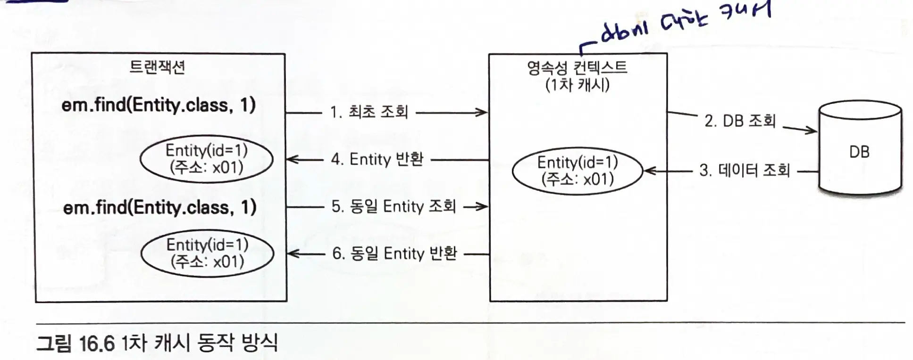
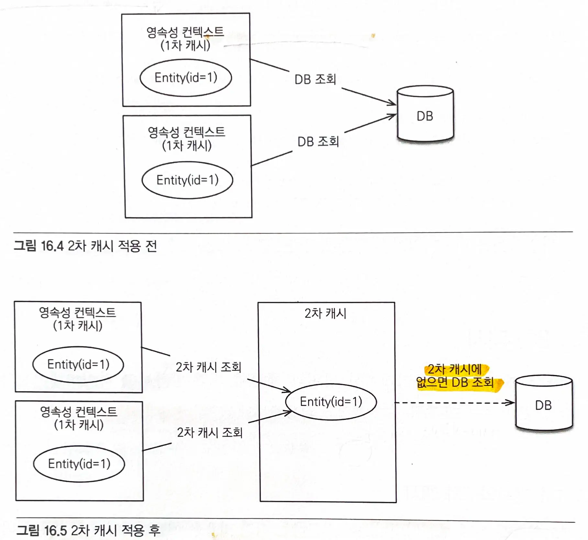
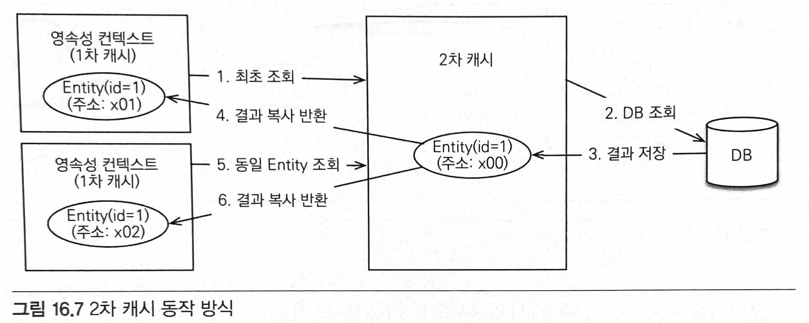

# 16. 트랜잭션과 락, 2차 캐시
# 16.1 트랜잭션과 락
- 트랜잭션 `ACID`
  - **원자성** : 트랜잭션 내에서 실행한 작업들은 마치 하나의 작업인 것처럼 **모두 성공하거나 모두 실패해야 한다.** (All or Nothing)
  - **일관성** : 모든 트랜잭션은 **일관성 있는 데이터베이스 상태를 유지해야 한다.** (무결성 제약조건)
  - **격리성** : 동시에 실행되는 **트랜잭션들이 서로에게 영향을 미치지 않도록 격리한다.**
  - **지속성** : 트랜잭션을 성공적으로 끝내면 **그 결과가 항상 기록되어야 한다.** (로그로 기록)
- 트랜잭션 격리 수준
  - `READ UNCOMMITED` -> `DIRTY READ` 문제 (수정 중인 데이터 조회)
  - `READ COMMITED` -> `NON-REPEATABLE READ` 문제 (반복해서 같은 데이터를 읽을 수 없는 상태)
  - `REPEATABLE READ` -> `PHANTOM READ` 문제 (반복 조회시 결과 집합이 달라지는 것)
  - `SERIALIZABLE` -> 동시성 처리 성능이 급격히 떨어지는 문제
- 데이터베이스들은 보통 `READ COMMITED` 격리 수준을 기본으로 사용한다.
> 데이터베이스들이 더 많은 동시성 처리를 위해 락보다는 MVCC를 사용한다.

## 낙관적 락과 비관적 락
- JPA의 `영속성 컨텍스트(1차 캐시)`를 적절히 활용하면 `READ COMMITED` 격리 수준이어도 애플리케이션 레벨에서 `반복가능한 읽기(REPEATABLE READ`)`가 가능하다.
- JPA는 트랜잭션 격리수준을 `READ COMMITED`으로 가정한다.
  - 더 높은 격리 수준이 필요하면 **낙관적 락**과 **비관적 락** 중 하나를 사용하면 된다.

### **낙관적 락**
- 트랜잭션 대부분은 충돌이 발생하지 않는다고 가정한다.
  - JPA가 제공하는 버전 관리 기능을 사용한다.
  - 애플리케이션이 제공하는 락이다.
> 트랜잭션을 커밋하기 전까지는 트랜잭션의 충돌을 알 수 없다.
### **비관적 락**
- 트랜잭션의 충돌이 발생한다고 가정하고 락을 걸고 보는 방법이다.
  - 데이터베이스가 제공하는 락 기능 사용한다.
  - `select for update`

### 두번의 갱신 분실 문제
- 데이터베이스 트랜잭션 범위를 넘어선다. (트랜잭션으로 문제를 해결할 수 없다.)

- 해결 방법
1. 마지막 커밋만 인정하기
2. 최초 커밋만 인정하기
3. 충돌하는 갱신 내용 병합하기
> 기본은 마지막 커밋만 인정하기가 사용된다.
> JPA가 제공하는 버전 관리 기능을 사용하면 최초 커밋만 인정하기를 구현할 수 있다.

### @Version : 버전 관리용 필드
- JPA가 제공하는 낙관적 락을 사용하려면 `@Version`을 사용해서 버전 관리 기능을 추가해야 한다.
- Version 적용 가능 타입
  - `Long`
  - `Integer`
  - `Short`
  - `Timestamp`
```java
@Entity
public class Board {

	@Id
	private String id;
	private String title;

	@Version
	private Integer version;
}
```
- **엔티티를 수정할 때마다 버전이 하나씩 자동으로 증가한다.**
  - 엔티티를 수정할 때 `조회 시점의 버전`과 `수정 시점의 버전`이 다르면 예외가 발생한다.
  - 버전 정보를 사용하면 **최초 커밋만 인정하기**가 적용된다.

#### JPA가 버전 정보를 비교하는 방법
- 엔티티를 수정하고 트랜잭션을 `커밋`하면 영속성 컨텍스트를 `flush`하면서 `update` 쿼리를 실행한다.
  - 버전을 사용하는 엔티티면 검색 조건에 엔티티의 `버전 정보`를 추가한다. (버전 + 1)
  - db 버전과 엔티티 버전이 같으면 동시에 버전을 증가시키고, 다르면 예외를 발생시킨다.

> `임베디드 타입`과 `값 타입` 컬렉션은 논리적인 개념 상 엔티티의 값이므로 수정하면 엔티티의 버전이 증가한다.
> `연관관계 필드`는 외래키를 관리하는 연관관계의 주인 필드를 수정할 때만 버전이 증가한다.

> @Version으로 추가한 버전 관리 필드는 JPA가 직접 관리하므로 개발자가 임의로 수정하면 안된다.

> 벌크 연산은 버전을 무시한다. 버전을 증가하려면 버전 필드를 강제로 증가시켜야한다.

## JPA 락
- `JPA`를 사용할 때 추천하는 전략: `READ COMMITED` 격리 수준 + `낙관적 버전 관리` (두번의 갱신 내역 분실 문제 예방)

### JPA 낙관적 락
- 버전(`@Version`)을 사용한다.
- 낙관적 락은 트랜잭션을 커밋하는 시점에 충돌을 알 수 있다.
> 락 옵션 없이 `@Version`만 있어도 낙관적 락이 적용된다.

#### 적용 위치
- EntityManager.lock(), EntityManger.find(), EntityManager.refresh()
- Query.setLockMode() (TypeQuery 포함)
- @NamedQuery

#### 조회하면서 즉시 락을 걸 수도 있다.
```java
Board board = em.find(Board.class, id, LockModeType.OPTIMISTIC);
```

#### 필요할 때 락을 걸 수도 있다.
```java
Board board = em.find(Board.class, id);
em.lock(board, LockModeType.OPTIMISTIC);
```

JPA가 제공하는 락 옵션은 javax.persistence.`LockModeType`에 정의되어 있다.

#### LockModeType

| 락 모드  | 타입                            | 설명                                                     |
| ----- | ----------------------------- | ------------------------------------------------------ |
| 낙관적 락 | `OPTIMISTIC`                  | 낙관적 락을 사용한다.                                           |
| 낙관적 락 | `OPTIMISTIC_FORCE_INCREMENT`  | 낙관적 락 + 버전정보를 강제로 증가한다.                                |
| 비관적 락 | `PESSIMISTIC_READ`            | 비관적 락, 읽기 락을 사용한다.                                     |
| 비관적 락 | `PESSIMISTIC_WRITE`           | 비관적 락, 쓰기 락을 사용한다.                                     |
| 비관적 락 | `PESSIMISTIC_FORCE_INCREMENT` | 비관적 락 + 버전정보를 강제로 증가한다.                                |
| 기타    | `NONE`                        | 락을 걸지 않는다.                                             |
| 기타    | `READ`                        | JPA1.0 호환 기능이다. OPTIMISTIC과 같은 모드 OPTIMISTIC을 사용하면 된다. |
| 기타    | `WRITE`                       | JPA1.0 호환 기능이다. OPTIMISTIC_FORCE_INCREMENT와 같다.        |

**NONE**
- 락 옵션을 적용하지 않아도 엔티티에 `@Version`이 적용된 필드만 있으면 낙관적 락이 적용된다.
- 용도) 조회한 엔티티를 **수정**할 때 다른 트랜잭션에 의해 변경(삭제)되지 않아야 한다. (조회~수정 시점 보장)
- 동작) 엔티티를 수정할 때 버전을 체크하면서 버전을 증가한다.
- 이점) **두번의 갱신 분실 문제를 예방**한다.

**OPTIMISITC**
- 엔티티를 **조회**하거나 **수정**할때 버전을 체크한다.
  - 한번 조회한 엔티티는 트랜잭션을 종료할 때까지 다른 트랜잭션에서 변경되지 않음을 보장한다.
- 용도) 조회 시점부터 트랜잭션이 끝날때까지 조회한 엔티티가 변경되지 않음을 보장한다.
- 동작) 트랜잭션을 커밋할 때 버전 정보를 조회해서 현재 엔티티의 버전과 같은지 검증한다.
- 이점) `DIRTY READ`와 `NON-REPEATABLE READ`를 방지한다.

**OPTIMISITIC_FORCE_INCREMENT**
- 낙관적 락을 사용하면서 `버전 정보를 강제로 증가`한다.
- 용도) **논리적인 단위의 엔티티 묶음을 관리**할 수 있다.
  - `논리적으로 변경`될 경우(연관관계 필드 변경) 버전을 강제로 증가한다.
- 동작) 엔티티를 수정하지 않아도 트랜잭션을 커밋할 때 `UPDATE 쿼리`를 사용해 버전 정보를 강제로 증가시킨다.
  - 엔티티 수정시에도 버전 `UPDATE`가 발생한다. (2번의 버전 증가)
- 이점) 강제로 버전을 증가해서 논리적인 단위의 엔티티 묶음을 버전 관리할 수 있다.
  - `Aggregate Root`를 관리하는 엔티티를 수정했을 때 `Aggregate Root` 버전을 강제로 증가시킬 수 있다.

#### 낙관적 락에서 발생하는 예외
- `OptimisticLockException` (JPA 예외)
- `StaleObjectStateException` (하이버네이트 예외)
- `ObjectOptimisticLockingFailureException` (스프링 예외 추상화)

### JPA 비관적 락
- db 트랜잭션 락 메커니즘에 의존하는 방법이다.
- sql 쿼리에 `select for update` 구문을 사용하면서 시작하고, 버전 정보는 사용하지 않는다.
- 주로 `PESSIMISITC_WRITE` 모드를 사용한다.

#### 특징
- 엔티티가 아닌 `스칼라 타입`을 조회할 때도 사용할 수 있다.
- **데이터를 수정하는 즉시 트랜잭션 충돌을 감지**할 수 있다.

**PESSIMISITIC_WRITE**
- 용도) 데이터베이스에 `쓰기 락`을 걸때 사용한다.
- 동작) `select for update`를 사용해서 락을 건다.
- 이점) `NON-REPEATABLE READ`을 방지한다.
  - 락이 걸린 로우는 다른 트랜잭션이 수정할 수 없다.

**PESSIMISITIC_READ**
- 데이터를 `반복 읽기`만 하고 수정하지 않는 용도로 락을 걸 때 사용한다.
- 일반적으로 잘 사용하지 않는다.
- MySQL : `lock in share mode`

**PESSIMISITIC_FORCE_INCREMENT**
- 비관적 락 중 버전 정보를 유일하게 사용한다.
  - 비관적 락이지만 버전 정보를 강제로 증가시킨다.
- 하이버네이트는 `nowait`를 지원하는 데이터베이스에 대해서 `for update nowait` 옵션을 적용한다.

#### 낙관적 락에서 발생하는 예외
- `PessimisticLockException` (JPA 예외)
- `PessimisticLockingFailureException` (스프링 예외 추상화)

### 비관적 락과 타임아웃
- **비관적 락**을 사용하면 **락을 획득할 때까지 트랜잭션이 대기**한다.
- **타임아웃 시간**만큼 대기해서 응답이 없으면 `LockTimeoutException` 예외가 발생한다.

# 16.2 2차 캐시
## 1차 캐시와 2차 캐시
- 네트워크를 통해 db에 접근하는 시간 비용은 애플리케이션 서버에서 내부 메모리에 접근하는 시간 비용보다 비싸다.
  - 조회한 데이터를 메모리에 **캐시**해서 데이터베이스 접근 횟수를 줄이면 애플리케이션 성능을 개선할 수 있다.

### 1차 캐시
- 영속성 컨텍스트 내부에 **엔티티를 보관하는 장소**
- **엔티티 매니저로 조회하거나 변경하는 모든 엔티티**는 1차 캐시에 저장된다.
  - 트랜잭션을 `커밋`하거나 `flush`를 호출하면 1차 캐시에 있는 엔티티 변경 내역을 데이터베이스에 `동기화`한다.
- 일반적인 웹 애플리케이션 환경은 **트랜잭션을 시작하고 종료**할 때까지만 1차 캐시가 유효하다.
- OSIV를 사용해도 **클라이언트의 요청이 들어올 때부터 끝날 때**까지만 1차 캐시가 유효하다.
  - 애플리케이션 전체에서 보면 데이터베이스 접근 횟수를 획기적으로 줄이지는 못한다.
- 1차 캐시는 켜고 끌 수 있는 옵션이 아니다.
  - **영속성 컨텍스트 자체가 사실상 1차 캐시이다.**

#### 1차 캐시 동작 방식



- `최초 조회`할 때는 `1차 캐시`에 엔티티가 없으므로 **데이터베이스에서 엔티티를 조회해서 1차 캐시에 보관**하고 1차 캐시에 보관한 결과를 반환한다.
- 이후 같은 엔티티를 조회하면 1차 캐시에 같은 엔티티가 있으므로 **데이터베이스를 조회하지 않고 1차 캐시의 엔티티를 그대로 반환**한다.

#### 1차 캐시 특징
- 1차 캐시는 같은 엔티티가 있으면 해당 엔티티를 그대로 반환한다.
  - 1차 캐시는 `객체 동일성`을 보장한다.
- 1차 캐시는 기본적으로 `영속성 컨텍스트 범위의 캐시`이다.
  - 컨테이너 환경: 트랜잭션 범위의 캐시
  - OSIV:  요청 범위의 캐시

### 2차 캐시


- **애플리케이션 범위의 캐시**, 공유 캐시 또는 2차 캐시라고 한다.
  - 애플리케이션을 종료할 때까지 캐시가 유지된다.
  - `애플리케이션 조회 성능`을 향상할 수 있다.
  - `분산 캐시`나 `클러스터링 환경의 캐시`는 애플리케이션보다 더 오래 유지될 수도 있다.
- `엔티티 매니저`를 통해 데이터를 조회할 때 우선 `2차 캐시`에서 찾고, 없으면 `데이터베이스`에서 찾는다.
  - `2차 캐시`를 적절히 활용하면 **데이터베이스 조회 횟수를 획기적으로 줄일 수 있다.**

#### 2차 캐시 동작 방식


- `영속성 컨텍스트`는 엔티티가 필요하면 `2차 캐시`를 조회한다.
- `2차 캐시`에 엔티티가 없으면 **데이터베이스를 조회해서 결과를 2차 캐시에 보관**한다.
- `2차 캐시`는 자신이 **보관하고 있는 엔티티를 복사해서 반환**한다.
- `2차 캐시`에 저장되어 있는 엔티티를 조회하면 복사본을 만들어 반환한다.
  - 2차 캐시는 `동시성을 극대화`하기 위해 캐시한 객체의 복사본을 반환한다(락 방지)
  - 캐시한 객체를 그대로 반환하면 같은 객체를 동시에 수정하는 문제가 발생할 수 있으므로 복사본을 반환한다.

- hibernate를 포함한 대부분의 JPA 구현체들은 2차 캐시를 지원한다.
#### 2차 캐시 특징
- `영속성 유닛 범위`의 캐시이다.
- 조회한 객체의 복사본을 만들어서 반환한다.
- 2차 캐시는 `데이터베이스 기본 키`를 기준으로 캐시하지만 영속성 컨텍스트가 다를 경우 `객체 동일성`을 보장하지 않는다.

## JPA 2차 캐시 기능
- JPA는 캐시 표준을 정의했다.

### 캐시 모드 설정
```java
@Cacheable
@Entity
public class Member {

	@Id @GeneratedValue
	private Long id;

}
```
`@Cacheable`로 설정하고, 기본값은 `true`이다.

- `persistence.xml`에 `shared-cache-mode`를 설정하여 옵션을 설정해야 한다.

#### SharedCacheMode
- `ALL` : 모든 엔티티 캐시
- `NONE` : 캐시를 사용하지 않음
- `ENABLE_SELECTIVE` : Cacheable(true)로 설정된 엔티티만 캐시 적용
- `DISABLE_SELECTIVE` : 모든 엔티티를 캐시하는데 Cacheable(false)로 명시된 엔티티는 캐시하지 않음
- `UNSPECIFIED` : JPA 구현체가 정의한 설정에 따름

### 캐시 조회, 저장 방식 설정
- 캐시를 무시하고 데이터베이스를 직접 조회하거나 캐시를 갱신하려면 `캐시 조회 모드`와 `캐시 보관 모드`를 사용하면 된다.

#### 캐시 조회 모드 (`CacheRetrieveMode`)
- `USE` : 캐시에서 조회 (기본값)
- `BYPASS` : 캐시를 무시하고 데이터베이스에 직접 접근

#### 캐시 보관 모드 (`CacheStoreMode`)
- `USE` : 조회한 데이터를 캐시에 저장
- `BYPASS` : 캐시에 저장하지 않음
- `REFRESH`: USE 전략에 추가로 데이터베이스에 조회한 엔티티를 최신 상태로 다시 캐시

### JPA 캐시 관리 API
- `Cache 인터페이스`를 사용하여 관리한다.
  - contains, evict, evictAll, unwrap

### 하이버네이트와 EHCACHE 적용
1. **엔티티 캐시** : 엔티티 단위로 캐시한다.
   식별자로 엔티티를 조회하거나 컬렉션이 아닌 연관된 엔티티를 로딩할 때 사용한다.
2. **컬렉션 캐시**: 엔티티와 연관된 컬렉션을 캐시한다.
   컬렉션이 엔티티를 담고 있으면 식별자 값만 캐시한다.
3. **쿼리 캐시** : `쿼리`와 `파라미터` 정보를 키로 사용해서 캐시한다.
   결과가 엔티티면 식별자 값만 캐시한다.

#### 환경 설정
- `ehcache.xml` : 캐시 정책 정의하는 설정 파일
- `persistence.xml` 에 캐시 정보 추가
  - `use_second_level_cache` : 2차 캐시 활성화
  - `use_query_cache` : 쿼리 캐시를 활성화
  - `factory_class` : 2차 캐시를 처리할 클래스 지정
  - `generate_statistics` : 통계정보 출력, 캐시 적용 여부 확인 가능

### 엔티티 캐시와 컬렉션 캐시
#### `@Cache` : 세밀한 캐시 설정 가능
- `usage` : 캐시 동시성 전략 설정
- `region` : 캐시 지역 설정
- `include` : 연관 객체를 캐시에 포함할지 선택

#### `CacheConcurrencyStrategy` ( 캐시 동시성 전략 설정)
- `NONE` : 캐시를 설정하지 않는다.
- `READ_ONLY` : 읽기 전용으로 설정한다.
  - 등록, 삭제는 가능하지만 수정은 불가능하다.
- `NONSTRICT_READ_WRITE` : 엄격하지 않은 읽고 쓰기 전략
- `READ_WRITE` : 읽고 쓰기가 가능하고 `READ COMMITTED` 정도의 격리 수준 보장
- `TRANSACTIONAL` : 컨테이너 관리 환경에서 사용, `REPEATABLE_READ` 정도의 격리 수준 보장

### 캐시 영역
- 엔티티 캐시 영역 : `ParentMember`
  - 기본값으로 `패키지명 + 클래스명`을 사용한다.
- 컬렉션 캐시 영역 : `ParentMember.childMembers`
  - 엔티티 캐시 영역은 엔티티 캐시 영역 이름에 캐시한 `컬렉션의 필드명`이 추가된다.

**쿼리 캐시**
- 쿼리와 파라미터 정보를 키로 사용해서 쿼리 결과를 캐시하는 방법
- `use_query_cache` 옵션 `true`로 설정 후 적용할 쿼리마다 `cacheable`을 `true`로 설정
- 쿼리 캐시 적용
```java
em.createQuery("select i from Item i", Item.class) .setHint("org.hibernate.cacheable", true) .getResultList();
```

- NamedQuery에 쿼리 캐시 적용
```java
// 예제 16.22 NamedQuery에 쿼리 캐시 적용
@Entity
@NamedQuery(
    hints = @QueryHint(name = "org.hibernate.cacheable", 
                       value = "true"),
    name = "Member.findByUsername",
    query = "select m.address from Member m where m.name = :username"
)
public class Member {
    ...
}
```

**쿼리 캐시 영역**
- `StandardQueryCache` : `쿼리 캐시`를 저장하는 영역
  - `쿼리`, `쿼리 결과 집합`, 쿼리를 실행한 시점의 `타임스탬프`를 보관한다.
- `UpdateTimestmpsCache` : 쿼리 대상 테이블의 `가장 최근 변경 시간` 저장
  - 쿼리 캐시가 유효한지 확인하기 위해 쿼리 대상 테이블의 가장 최근 변경 시간을 저장한다.
  - `테이블 명`과 최근 변경된 `타임스탬프`를 보관한다.
- `쿼리 캐시`는 캐시한 데이터 집합을 최신 데이터로 유지하려고 `쿼리 캐시를 실행하는 시간`과 쿼리 캐시가 사용하는 테이블들이 `가장 최근에 변경된 시간`을 비교한다.
  - 쿼리 캐시를 적용하고 난 후에 쿼리 캐시가 사용하는 테이블에 조금이라도 **변경이 있으면 데이터베이스에서 데이터를 읽어와서 쿼리 결과를 캐시**한다.
  - 엔티티를 변경하면 `UpdateTimestampsCache` 캐시 영역에 해당 엔티티가 매핑한 테이블 이름으로 타임스탬프를 갱신한다.

#### 변경 예시
```java
public List<ParentMember> findParentMembers() {
    return em.createQuery("select p from ParentMember p join p.childMembers c", ParentMember.class)
        .setHint("org.hibernate.cacheable", true)
        .getResultList();
}
```
- 1. 쿼리를 실행하면 우선 `StandardQueryCache` 캐시 영역에서 타임스탬프를 조회한다.
- 2. 쿼리가 사용하는 엔티티의 테이블인 `PARENTMEMBER`, `CHILDMEMBER`를 `UpdateTimestmpsCache` 캐시 영역에서 조회해서 테이블들의 타임스탬프를 확인한다.
- 3. 이때 만약 `StandardQueryCache` 캐시 영역의 **타임스탬프가 더 오래되었으면** 캐시가 유효하지 않은 것으로 보고 **데이터베이스에서 데이터를 조회해서 다시 캐시한다**.
> 쿼리 캐시를 활용하면 극적인 성능 향상이 있지만 빈번하게 변경이 있는 테이블에 사용하면 오히려 성능이 더 저하된다.
> 수정이 거의 일어나지 않은 테이블에 사용해야 효과를 볼 수 있다.

> `UpdateTimestmpsCache` 쿼리 캐시 영역은 만료되지 않도록 설정해야 한다.
> 해당 영역이 만료되면 모든 쿼리 캐시가 무효화된다.
> EHCACHE의 `eternal=true` 옵션을 사용하면 캐시에서 삭제되지 않는다.

### 쿼리 캐시와 컬렉션 캐시의 주의점
- `엔티티 캐시`를 사용해서 엔티티를 캐시하면 **엔티티 정보를 모두 캐시**하지만 `쿼리 캐시와 컬렉션 캐시`는 **결과 집합의 식별자 값만 캐시**한다.
  - 따라서 `쿼리 캐시`와 `컬렉션 캐시`를 조회하면 그 안에는 식별자 값만 들어 있다.
  - 식별자 값을 하나씩 `엔티티 캐시`에서 조회해서 실제 엔티티를 찾아야 한다.
- `쿼리 캐시`나 `컬렉션 캐시`를 사용하면 결과 대상 엔티티에는 꼭 엔티티 캐시를 적용해야 한다.
  - 식별자로 실제 엔티티를 찾기 위해 db에서 하나하나 조회해야해서 성능 문제가 발생한다.

## 정리
- 트랜잭션의 격리 수준은 4단계가 있다.
  - 격리 수준이 낮을수록 동시성은 증가하지만 격리 수준에 따른 다양한 문제가 발생한다.
- 영속성 컨텍스트는 데이터베이스 트랜잭션이 `READ COMMITED` 격리 수준이어도 애플리케이션 레벨에서 `REPEATABLE READ`를 제공한다.
- JPA는 `낙관적 락`과 `비관적 락`을 지원한다.
  - **낙관적 락** : 애플리케이션이 지원하는 락
  - **비관적 락** : 데이터베이스 트랜잭션 락 메커니즘에 의존
- `2차 캐시`를 사용하면 애플리케이션 조회 성능을 극적으로 끌어올릴 수 있다.
