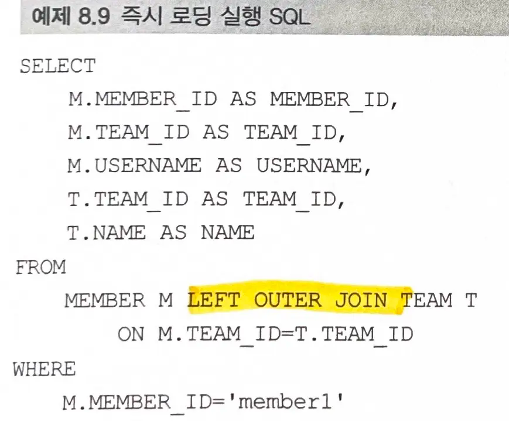

# 8장. 프록시와 연관관계 관리
# 8.1 프록시
- 객체는 객체 그래프로 연관된 객체들을 탐색한다.
    - 객체가 db에 저장되어있으므로 `연관된 객체를 탐색`하기 위해 프록시 기술을 사용한다.
- `프록시` : 연관된 객체를 db에서 조회하는 것이 아닌, **사용 시점에 db에서 조회하는 것**
    - `즉시 로딩`과 `지연 로딩`으로 지원한다.
- **연관된 객체를 함께 저장하고 제거**하기 위해 `영속성 전이`와 `고아 객체 제거` 기능을 제공한다.

### 지연 로딩
- 엔티티가 실제 사용될 때까지 데이터베이스 조회를 지연하는 방법
- `프록시 객체`: 실제 엔티티 객체 대신에 **데이터베이스 조회를 지연할 수 있는 가짜 객체**

### 엔티티 직접 조회 , 프록시 조회


- `em.find(Member.class, "member1")` :  엔티티 db 조회
- `em.getReference(Member.class, "member1")`; : 프록시 조회

### 프록시 특징


- **프록시 클래스는 실제 클래스를 상속**받아 만들어지므로 실제 클래스와 겉모양이 같다.
    - 진짜 객체인지 프록시 객체인지 사용자가 구분하지 않고 사용해도 된다.

- 프록시 객체는 **실제 객체에 대한 참조(`target`)를 보관**한다.
    - 프록시 객체의 메서드를 호출하면 프록시 객체는 **실제 객체의 메서드를 호출**한다.
- 프록시 객체는 처음 사용할때 한번만 초기화된다.
    - **프록시 객체가 초기화되면 프록시 객체를 통해 실제 엔티티에 접근**할 수 있다. (`target 필드에 참조 보관`)
        - 준영속 상태의 프록시를 초기화하면 문제가 발생한다.
- 영속성 컨텍스트에 찾는 엔티티가 이미 있으면 **프록시로 조회해도 실제 엔티티를 반환**한다.
```java
Member member = em.getReference(Member.class, "id1");
transaction.commit();
em.close();

member.getName();
```

### 프록시 객체의 초기화


- 프록시 객체가 실제 사용될 때 db에서 조회해서 실제 엔티티 객체를 생성한다.

#### 과정


1. **실제 데이터 조회**: 프록시 객체에서 실제 엔티티의 메서드 호출
```java
Member member = em.getReference(Member.class, "id1");
member.getName(); // 실제 객체의 메서드 호출
```

2. **초기화 요청** : 영속성 컨텍스트에 실제 엔티티 생성 요청
3. **DB 조회** : 데이터베이스를 조회하여 실제 엔티티 객체 생성
4. **멤버변수에 보관** : 실제 엔티티 생성 및 참조 보관(target)
5. **결과 반환**: 실제 엔티티 객체의 메서드 호출

### 프록시와 식별자
- 프록시로 조회할때 식별자값으로 조회하는데, 프록시 객체는 `식별자 값을 보관`한다.
    - 식별자 값을 조회하는 `getId()`를 호출해도  프록시 객체를 초기화하지 않는다.
    - 엔티티 접근 방식이 `프로퍼티 접근 방식`(getter)일 경우만 해당한다.
> 필드 접근 방식일 경우 getId()안에 별도의 로직이 있을 수 있으므로 프록시 객체를 초기화한다.

> **-> Hibernate의 경우 `getId()`와 같은 `getIdentifier()`는 db를 초기화하지 않는다.**

- 연관관계를 설정할때는 식별자만 사용하므로 db 조회없이 프록시를 이용하면 된다.
    - 연관관계 설정시에는 필드 접근 방식이어도 프록시를 초기화하지 않는다.

### 프록시 확인
- `PersistenceUnitUtil.isLoaded(Object entity)` : 프록시 인스턴스의 초기화 여부 확인
    - 이미 초기화되었거나 프록시 인스턴스가 아니면 true
> hibernate의 initialize()를 통해 프록시를 강제로 초기화할 수 있다.

# 8.2 즉시 로딩과 지연 로딩
- 프록시 객체는 연관된 엔티티를 지연 로딩할 때 사용한다.

## 엔티티 조회 시점 선택
### 즉시 로딩


- 엔티티를 조회할때 **연관된 엔티티도 함께 조회**
- `@ManyToOne(fetch = FetchType.EAGER)`
- 즉시 로딩을 최적화하기 위해 가능하면 `조인 쿼리`를 사용한다.
    - `LEFT OUTER JOIN` 사용
    - `NOT NULL` 제약조건일 경우 `INNER JOIN` 사용, 성능 유리
        - `@JoinColumn(nullable=false)`
- 연관된 엔티티가 자주 함께 사용할 경우

### 지연 로딩
- 실제 사용하기 전까지는 **프록시로 조회**한다.
- 엔티티를 **실제 사용할 때 초기화하면서 db 조회**
    - `member.getTeam().getName()`
- `@ManyToOne(fetch = FetchType.LAZY)`
- 연관된 엔티티가 가끔 함께 사용할 경우

#### 예시
- member와 team은 자주 함께 사용 => 즉시 로딩
- member와 order는 가끔 한번 사용 => 지연 로딩
```java
@Entity
public class Member{

    @Id @GeneratedValue
    @Column(name = "MEMBER_ID")
    private Long id;

	@ManyToOne(fetch = FetchType.EAGER)
	private Team team;

    @OneToMany(mappedBy = "member", fetch = FetchType.LAZY)
    private List<Order> orders;

    //Getter, Setter
}
```

- SQL


> LAZY로 설정한 order는 sql에 전혀 나타나지 않는다.

### 프록시와 컬렉션 래퍼
#### 컬렉션 래퍼
- 하이버네이트는 엔티티를 영속  상태로 만들때 엔티티에 컬렉션이 있으면 **관리 목적으로 하이버네이트가 지원하는 내장 컬렉션으로 변경**한다.
- 컬렉션 래퍼는 `컬렉션에 대한 프록시` 역할을 하며, `지연 로딩`을 처리해준다.
```java
Member member = em.find(Member.class, "id1");
List<Order> orders = member.getOrders(); // 컬렉션 래퍼

System.out.print(member.getOrders());  // 프록시 조회
System.out.print(member.getOrders().get(0)); // 프록시 초기화
```

### JPA 기본 Fetch 전략 (FetchType)
- **즉시 로딩** : `@ManyToOne`, `@OneToOne
    - `optional = false` : 내부 조인
    - `optional = true` : 외부 조인
- **지연 로딩**: `@OneToMany`, `@ManyToMany`
    - `optional = false` : 외부 조인
    - `optional = true` : 외부 조인

- 연관된 엔티티가 하나면 즉시 로딩을, 컬렉션이면 지연 로딩을 사용한다.
    - 컬렉션을 즉시 로딩하면 비용이 많이 들고 너무 많은 데이터를 로딩하기 때문이다.
- 추천방법: 모든 연관관계에 지연 로딩을 사용하자.
    - 꼭 필요한 곳에만 즉시 로딩을 사용하도록 최적화하자.

#### 즉시 로딩 사용시 주의점
- 컬렉션을 하나 이상 즉시 로딩하는 것은 권장하지 않는다.
    - 일대다 조인은 결과 데이터가 다 쪽의 수만큼 증가한다.
- 컬렉션 즉시 로딩은 외부 조인을 사용한다.
    - 선택 관계일 경우 연관된 엔티티가 없을 경우 조회가 되지 않는 문제를 해결하기 위함

# 8.4 영속성 전이  : CASCADE
- 특정 엔티티를 영속 상태로 만들때, 연관된 엔티티도 함께 영속 상태로 만들고 싶을 경우
    - `CASCADE`를 이용해 부모 엔티티를 저장할 때 자식 엔티티도 함께 저장할 수 있다.

### 예시
- 부모 - 자식
    - 자식 2명을 추가한다면?
```java
private static void saveNoCascade(EntityManager em) {
    // 부모 저장
    Parent parent = new Parent();
    em.persist(parent);

    // 1번 자식 저장
    Child child1 = new Child();
    child1.setParent(parent); // 자식 -> 부모 연관관계 설정
    parent.getChildren().add(child1); // 부모 -> 자식
    em.persist(child1);

    // 2번 자식 저장
    Child child2 = new Child();
    child2.setParent(parent); // 자식 -> 부모 연관관계 설정
    parent.getChildren().add(child2); // 부모 -> 자식
    em.persist(child2);
}	
```
- JPA에서 엔티티를 저장할 때 연관된 모든 엔티티는 영속 상태여야한다.
    - 부모 엔티티를 영속 상태로 만들고, 자식 엔티티도 영속 상태로 만든다.

> 영속성 전이를 사용하면 부모만 영속 상태로 만들면 연관된 자식까지 한번에 영속 상태로 만들 수 있다.

### 영속성 전이: 저장 (`CascadeType.PERSIST`)
```java
@Entity
public class Parent {
	@OneToMany(mappedBy = "parent", cascade = Cascade = CascadeType.PERSIST)
	private List<Child> children = new ArrayList<Child>();
}
```
- 부모와 자식 엔티티를 한번에 영속화할 수 있다.
```java
private static void saveWithCascade(EntityManager em) {
    Child child1 = new Child();
    Child child2 = new Child();

    Parent parent = new Parent();
    child1.setParent(parent);    // 연관관계 추가
    child2.setParent(parent);    // 연관관계 추가
    parent.getChildren().add(child1);
    parent.getChildren().add(child2);

    // 부모 저장, 연관된 자식들 저장
    em.persist(parent);    // 부모만 persist하면 자식까지 persist된다.
}
```

### 영속성 전이 : 삭제 (`CascadeType.REMOVE`)
- 부모와 자식 엔티티를 모두 제거하려면?
```java
Parent findParent = em.find(Parent.class, 1L);
Child findChild1 = em.find(Child.class, 1L);
Child findChild2 = em.find(Child.class, 2L);

em.remove(findChild1);
em.remove(findChild2);
em.remove(findParent);
```

-  `CascadeType.REMOVE` 로 설정하면 한번에 삭제할 수 있다.
```java
Parent findParent = em.find(Parent.class, 1L);
em.remove(findParent);
```

### CASCADE 주의할 점
```java
@Entity
public class Comment {
    @ManyToOne(cascade = CascadeType.REMOVE)
    @JoinColumn(name = "post_id")
    private Post post;
}
```
#### 자식 삭제시 부모도 함께 삭제
- `comment` 삭제시 `post`도 함께 삭제된다.
  - `comment1`과 `comment2`가 `post`와 연관되어있을때, `comment1`만 지우면 `post1`까지 함께 지워진다.
  - `comment2`는 삭제된 `post1`을 참조하기 때문에 **참조 무결성 제약조건을 위배한다.**

#### 양방향 매핑관계 매핑시 충돌
```java
@Entity
public class Post {
    @OneToMany(mappedBy = "post", cascade = CascadeType.PERSIST)
    private List<Comment> comments = new ArrayList<>();
}
```
- `Post` 저장시 `Comment`까지 함께 저장된다.
  - `comment1`과 `comment2`가 post와 연관되어있는데, `comment1`을 삭제했지만 `post`에 반영되지 않은 상태이다.
  - `post` 저장시 연관된 `comment1`과  `comment2`가 함께 저장되어 이미 삭제된 `comment1`이 저장된다.
- **문제 : comment를 Post와 Comment 양쪽에서 `상태를` 관리하고 있다.**
  - `Cascade` 옵션으로 인해 Post가 Comment의 생명주기에 영향을 미친다.
- 해결 : **연관관계 편의 메서드 구현**
  - `comment1` 삭제시 post와 연관된 `comment1`도 삭제한다.
> 영속성 전이(cascade)는 부모가 단 하나일때 사용해야한다.
> **단방향 연관관계**에서 사용하자.


### CASCADE 종류
```java
public enum CascadeType {
    ALL,      // 모두 적용
    PERSIST,  // 영속 -> 부모 자식 한번에 영속화
    MERGE,    // 병합 -> 부모 자식 한번에 병합 (detach -> persist)
    REMOVE,   // 삭제 -> 부모 자식 한번에 삭제
    REFRESH,  // REFRESH -> 부모 자식 한번에 새로 읽어오기 (DB 최신 상태로 변경)
    DETACH    // DETACH -> 부모 자식 한번에 detach
}
```
> `PERSIST` 와 `REMOVE` 는 바로 전이가 발생하지 않고,`flush`를 호출할 때 전이가 발생한다.

# 8.5 고아 객체

### 고아 객체 제거
- 부모 엔티티와 연관관계가 끊어진 자식 엔티티를 자동으로 삭제하는 기능
    - 참조가 제거된 엔티티는 다른 곳에서 참조하지 않는 고아 객체로 보고 삭제한다.
    - 참조하는 곳이 하나일때만 사용해야한다. (`@OneToOne`, `@OneToMany`)
> 부모 엔티티의 컬렉션에서 자식 엔티티의 참조만 제거하면 자식 엔티티가 자동으로 삭제되도록 하자.

```java
@Entity
public class Parent {

    @Id @GeneratedValue
    private Long id;

    @OneToMany(mappedBy = "parent", orphanRemoval = true)
    private List<Child> children = new ArrayList<Child>();

}
```
- 컬렉션인 children에서 엔티티를 제거하면 db의 데이터도 삭제된다.
```java
parent1.getChildren().remove(0);
```
- 고아 객체 제거는 영속성 컨텍스트를 `flush`할 때 적용된다.
- 부모를 제거하면 자식도 함께 제거된다.
    - `CascadeType.REMOVE` 설정한 것과 같다.

# 8.6 영속성 전이 + 고아 객체, 생명주기
### `CascadeType.ALL` + `orphanRemoval = true` 동시 사용
- 부모 엔티티를 통해 자식의 생명주기를 관리할 수 있다.
    - 자식을 저장하면 부모에 등록만 하면 된다. (`CascadeType`)
    - 자식을 삭제하려면 부모에서 제거하면 된다. (`orphanRemoval`)

# 8.7 정리
- JPA 구현체들은 객체 그래프를 마음껏 탐색할 수 있도록 `프록시 기술`을 지원한다.
- 객체를 조회할때 연관된 엔티티를 즉시 로딩하는 방법을 `즉시 로딩`이라 하고, 연관된 객체를 지연해서 로딩하는 방법을 `지연 로딩`이라고 한다
- 객체를 저장하거나 삭제할때 연관된 객체도 함께 저장하고 삭제할 수 있다.
    - `영속성 전이`
- 부모 엔티티와 연관관계가 끊어진 자식 엔티티를 자동으로 삭제하려면 `고아 객체 제거` 기능을 사용하자.
